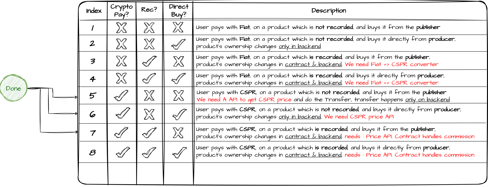

<u>[Droplinked Documentations](README.md)</u> >> Payment System

# <u>Droplinked Payment System</u>

## • <u>Possible Payment Types</u>



<h5>In the above image you can see all the possible payment types. In Droplinked we Implement Payments of type 2,6,7 and 8. 
The other types have logical problems or there is no need for them in Droplinked.

We use Stripe for payment type 2 & Crypto payment for other types. </h>

## • <u>Payment Process</u>

### - <u>Recordless Payment</u>

### <u>**Note : The flochart below needs to be updated (and soon will be updated), It's temporary!**</u>


### - <u>Direct Pay</u>

Un-recorded products still can be paid by CSPR. The purchaser calls the `direct_pay` method to purchase such products and transfer product price to the producer’s account. This methos receives the following as input:  
• sender_publicKey: purchaser’s publicKey  
• receiver_publicKey: producer’s public key  
• amount_in_usd: total price in US dollar  
`getCasperRatio` function returns the required US dollar to CSPR conversion ratio for calculating the total price in CSPR.

```javascript
import axios from "axios";
import {
  CLPublicKey,
  CLU512,
  CasperServiceByJsonRPC,
  DeployUtil,
  PurseIdentifier,
} from "casper-js-sdk";
import * as casper_consts from "./constants";
import { getCasperWalletInstance } from "./casper_wallet_auth";

/**
 *
 * @param {DeployUtil.Deploy} deploy_object
 */
async function transfer_details(deploy_object) {
  if (!deploy_object.isTransfer()) {
    return false;
  }
  let amount =
    Number(deploy_object.session.asTransfer().args.args.get("amount").data) /
    1000000000;
  let target = CLPublicKey.fromEd25519(
    deploy_object.session.asTransfer().args.args.get("target").data
  );
  let sender = deploy_object.header.account.toHex();
  return {
    sender: sender,
    amount_in_cspr: amount,
    target: target.toHex(),
  };
}
/**
 *
 * @param {number} usd_amount is the amount of USDs you want to convert to motes (each mote is 10^-9 CSPR)
 * @returns  the amount of motes that are equal to $usd_amount dollars
 */
async function getCasperRatio(usd_amount) {
  let js = (
    await axios.post("https://apiv2.droplinked.com/payment/casper/price", {
      usd_amount: usd_amount,
    })
  ).data.data;
  return new CLU512(js);
}
async function direct_pay(sender_publicKey, reciver_publicKey, amount_in_usd) {
  let amount_of_motes = await getCasperRatio(amount_in_usd);
  const toPublicKey = CLPublicKey.fromHex(reciver_publicKey);
  const fromPublicKey = CLPublicKey.fromHex(sender_publicKey);
  const deploy = DeployUtil.makeDeploy(
    new DeployUtil.DeployParams(fromPublicKey, "casper", 1, 1800000),
    DeployUtil.ExecutableDeployItem.newTransfer(
      amount_of_motes.value(),
      toPublicKey,
      null,
      0
    ),
    DeployUtil.standardPayment(100000000)
  );
  const json = DeployUtil.deployToJson(deploy);
  const signature = await getCasperWalletInstance()
    .sign(JSON.stringify(json), sender_publicKey)
    .catch((reason) => {
      return "Cancelled";
    });
  const signedDeploy = DeployUtil.setSignature(
    deploy,
    signature.signature,
    CLPublicKey.fromHex(sender_publicKey)
  );
  let casper_service = new CasperServiceByJsonRPC(
    "https://apiv2.droplinked.com/http-req?method=post&url=http://45.14.135.77:7777/rpc"
  );

  const deployres = await casper_service.deploy(signedDeploy);
  return { deploy: deployres, deployHash: deployres.deploy_hash };
}

/**
 *
 * @param {string} publicKey
 * @returns {Promise<number>} balance
 */
export async function get_casper_balance(publicKey) {
  let pk = CLPublicKey.fromHex(publicKey);
  let stateRootHash = await casper_consts.casperService.getStateRootHash();
  let balance_uref =
    await casper_consts.casperService.getAccountBalanceUrefByPublicKey(
      stateRootHash,
      pk
    );
  let balance = await casper_consts.casperService.getAccountBalance(
    stateRootHash,
    balance_uref
  );
  return balance.toNumber();
}

/**
 *
 * @param {number} price_in_usd
 * @param {string} publicKey
 * @returns {Promise<boolean>}
 */
export async function check_balance_on_product(price_in_usd, publicKey) {
  let expected_amount = (await getCasperRatio(price_in_usd)).data.toNumber();
  let current_amount = await get_casper_balance(publicKey);
  return current_amount > expected_amount;
}

export { direct_pay };
```

### - <u>Affiliate Payment (Recorded Payment)</u>

The `buy_product` method is used for buying a recorded product from a publisher. This method receives the following as input:  
 • quantity: number of the product that the purchaser tends to buy  
 • approved_id: approved_id related to the chosen product, which includes the publisher’s account info  
 • shipping_price  
 • tax_price  
 • product_price  
 • account_information: the purchaser’s account information  
Total price is calculated in US dollars and is paid in CSPR. `get_price_signature` function returns the required conversion rate to convert the US dollar price to its equivalent in CSPR.

```javascript
import axios from "axios";
import * as casper_consts from "./constants";
import {
  CLByteArray,
  CLKey,
  CLPublicKey,
  CLString,
  CLU512,
  CLU64,
  Contracts,
  DeployUtil,
  NamedArg,
  RuntimeArgs,
} from "casper-js-sdk";
import { getCasperWalletInstance } from "./casper_wallet_auth";
async function get_price_signature() {
  let js = (
    await axios.get(
      "https://apiv2dev.droplinked.com/payment/casper/signed-price"
    )
  ).data.data;
  return js;
}
async function get_contract_hash() {
  let result = String(
    (await axios.get("https://apiv2dev.droplinked.com/storage/contract_hash"))
      .data.value
  );
  return casper_consts.contract_hash;
}

async function get_session() {
  let k = String(
    (await axios.get("https://apiv2dev.droplinked.com/storage/session")).data
      .value
  );
  return k;
}

function arrayBufferToBase64(buffer) {
  const binary = [];
  const bytes = new Uint8Array(buffer);
  for (let i = 0; i < bytes.length; i++) {
    binary.push(String.fromCharCode(bytes[i]));
  }
  return window.btoa(binary.join(""));
}

// Function to convert base64 to array buffer
function base64ToArrayBuffer(base64) {
  const binary = window.atob(base64);
  const bytes = new Uint8Array(binary.length);

  for (let i = 0; i < binary.length; i++) {
    bytes[i] = binary.charCodeAt(i);
  }
  return bytes.buffer;
}
/**
 *
 * @param {number} quantity
 * @param {number | Strign} approved_id
 * @param {number | String} shipping_price
 * @param {number | String} tax_price
 * @param {number | String} product_price
 * @param {{'publicKey' : string , 'account_hash' : string, 'signature' : string}} account_information
 */
export async function buy_product(
  quantity,
  approved_id,
  shipping_price,
  tax_price,
  product_price,
  account_information
) {
  let deployParams = new DeployUtil.DeployParams(
    CLPublicKey.fromHex(account_information.publicKey),
    casper_consts.network,
    1,
    1800000
  );
  let signed_price = await get_price_signature();
  let ratio = Number(signed_price.message.split("\n")[1].split(",")[0]);
  let shipping_price_512 = new CLU512(Math.floor(shipping_price * ratio));
  let tax_price_512 = new CLU512(Math.floor(tax_price * ratio));
  let amount_512 = new CLU512(
    Math.floor((product_price * quantity + tax_price + shipping_price) * ratio)
  );
  let args = {
    cnt: quantity,
    approved_id: new CLU64(approved_id),
    shipping_price: shipping_price_512,
    tax_price: tax_price_512,
    amount: amount_512,
    contract_hash: new CLKey(
      new CLByteArray(
        Contracts.contractHashToByteArray(await get_contract_hash())
      )
    ),
    current_price_timestamp: new CLString(
      String(signed_price.message.split("\n")[1])
    ),
    signature: new CLString(String(signed_price.signature)),
  };
  let arrayBuff = base64ToArrayBuffer(await get_session()); //await (await fetch('src/session.wasm')).arrayBuffer()

  //console.log(arrayBuff);
  //console.log(arrayBufferToBase64(arrayBuff));
  //return;
  let module_bytes = new Uint8Array(arrayBuff);
  let named_args = [];
  named_args.push(new NamedArg("amount", args.amount));
  named_args.push(new NamedArg("approved_id", args.approved_id));
  named_args.push(new NamedArg("cnt", new CLU64(quantity)));
  named_args.push(new NamedArg("shipping_price", args.shipping_price));
  named_args.push(new NamedArg("tax_price", args.tax_price));
  named_args.push(new NamedArg("contract_hash", args.contract_hash));
  named_args.push(
    new NamedArg("current_price_timestamp", args.current_price_timestamp)
  );
  named_args.push(new NamedArg("signature", args.signature));

  let runtime_args = RuntimeArgs.fromNamedArgs(named_args);
  const kk = DeployUtil.ExecutableDeployItem.newModuleBytes(
    module_bytes,
    runtime_args
  );
  const payment = DeployUtil.standardPayment(48013050000);
  let deploy = DeployUtil.makeDeploy(deployParams, kk, payment);
  const json = DeployUtil.deployToJson(deploy);
  const signature = await getCasperWalletInstance()
    .sign(JSON.stringify(json), account_information.publicKey)
    .catch((reason) => {
      return "Cancelled";
    });
  const signedDeploy = DeployUtil.setSignature(
    deploy,
    signature.signature,
    CLPublicKey.fromHex(account_information.publicKey)
  );
  const deployres = await casper_consts.casperService.deploy(signedDeploy);
  return { deploy: deployres, deployHash: deployres.deploy_hash };
}
```
