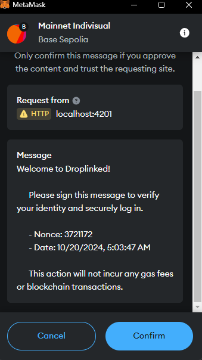

# Droplinked Web3-package

We use a single npm package which handles all the blockchain related interactions in our front-end projects inside of it.
In this document we are going to see how to use this package and work with it.

---

## 0.Initialization

The first phase is to initialize the DropWeb3 Object in your util files. Define this object only once in your project and we're going to use it multiple times.

```typescript
import { DropWeb3, Network } from '@droplinked/web3';

// The argument is the environment you are working in, you set it only once
const web3 = new DropWeb3(Network.TESTNET);
```

After defining the `web3` object we can use it whenever we want in our other functions.

---

## 1.Login with Wallet

The first usage of this package is login-with-wallet, this can happen in 2 ways:

### 1.1.Normal Login

In normal login, you specify the wallet address that you want the user to log-in with, (or you want to find out the user's address and do not specify this address), and the user will be shown a dialog with a message to sign:



To use this method you can use the code snippet below:

```typescript
import { Chain, Network, ChainWallet } from '@droplinked/web3';
// We use the `web3` object which we have already set-upped and have access to!
const chainProvider = web3.web3Instance({
	method: 'login', // This is the method you will be working with with this instance
	chain: Chain.BASE, // The chain you want your user to be in when signing in
	preferredWallet: ChainWallet.Metamask, // The wallet you want the user to use
});
const loginData = await chainProvider.walletLogin();
console.log({ loginData });
```

The result of running this code snippet has a structure of

```typescript
{
	address, signature, date, nonce;
}
```

which would be something like this:

```typescript
{
    "loginData": {
        "address": "0xbec8c184a8f55e6443b315361bac3bbb2280e8e8",
        "signature": "0xd4fb7e1a1009aba1a2fb6af94ca7d7bc1c2ff7ce1f46674162d3a92fd4f644e92467bb6361f8fa51c51bbb3a92d806bc5549dfb74e8a9f43efd780876abb26631b",
        "date": "10/20/2024, 5:03:47 AM",
        "nonce": 3721172
    }
}
```

After getting this info, the front-end part should send it to backend for verification step to be done.

How Login works:

- Front-end calls walletLogin of the package
- The package extracts the user's address from the wallet
- The package calls backend of droplinked, sends the user's wallet address and asks for a nonce
- The backend creates a nonce, and associates it with the users' wallet address
- The package uses that nonce and the current date to show a message to user to sign
- After the signing is done by user, the package returns this information to front-end, which consists of the wallet-address, the signature, the date which the message is signed in, and the nonce that the backend had generated for this wallet.
- The data is sent by `Front-end` to backend for verification
- Backend verifies the message signed by the user by using the nonce and date and the user wallet-address, also checks for the nonce to be the same as the one that back gave to the package

Note that each time a nonce is requested from backend by a wallet address, the previous nonce is invalidated and replaced by the new randomly created nonce.

### 1.2.Easy Login

This is exactly like the normal login, except that in the normal login, the user will be forced to switch chains to the given chain to the package, but this method uses the `web3` instance directly to get the user's wallet info.

```typescript
// Assuming the `web3` object is already defined and initialized
const info = await web3.getWalletInfo();
console.log({ info });
```

The returning result and the steps would be completely identical to the `normal-login` part except that the last 2 steps are optional if you just want to know the user's wallet address.

---

## 2.Deploy shop

The first step before recording any products, is to deploy the shop & nft contracts for the blockchain you are working with, this can be done by using the code snippet below:

```typescript
// Assuming the web3 is defined
const chainProvider = web3.web3Instance({
	method: 'deploy', // The function we will be using
	chain: Chain.BASE, // The chain we are deploying the contracts on
	preferredWallet: ChainWallet.Metamask, // The wallet the user will work with
	userAddress: '0xbec8c184a8f55e6443b315361bac3bbb2280e8e8',
});

const deploymentResult = await chainProvider.deployShop({
	shopAddress: 'https://droplinked.io/k3rn3lpanic', // Shop address
	shopDescription: 'k3rn3lpanic', // Description of the shop
	shopLogo: 'https://k3rn3lpaniclogo.png', // The logo url of the shop
	shopName: 'k3rn3lpanic', // The name of the shop
});

console.log({ deploymentResult });
```

Note that The `userAddress` field is required in the 'deploy' mode of the `web3Instance`. This should be set to the `connected-wallet-address` of the user.
The result of this code will be like this:

```typescript
deploymentResult : {
    "transactionHash": "0xed0f1af5054446a6d3cf5f5a0f17aa14560502874d15265ec657a345611a83cc",
    "deployedShopAddress": "0xD8edb8198e7eF42790Af2e43339c8454d10fA7CB",
    "deployedNFTAddress": "0x1C0b995351A7701692c634Bc8a3Ba8B3b10BCCBE"
}
```

---

## 3.Record product

After the shop is deployed and verified, now you can record your first product. To record the product follow the code snippet below:

```typescript
// Assuming the web3 is defined
const chainInstance = web3.web3Instance({
	method: 'record-affiliate',
	chain: Chain.BASE,
	preferredWallet: ChainWallet.Metamask,
	userAddress: '0xbec8c184a8f55e6443b315361bac3bbb2280e8e8',
	nftContractAddress: '0x1C0b995351A7701692c634Bc8a3Ba8B3b10BCCBE',
	shopContractAddress: '0xD8edb8198e7eF42790Af2e43339c8454d10fA7CB',
});

const recordResult = await chainInstance.recordProduct(
	{
		productTitle: '',
		description: '',
		royalty: 0,
		commission: 0,
		type: ProductType.DIGITAL,
		acceptsManageWallet: true,
		currencyAddress: '0x0000000000000000000000000000000000000000',
	},
	[
		{
			amount: 1,
			price: 100,
			beneficiaries: [],
			skuProperties: {},
			skuID: '670fcb2ea6738730848f8933',
			imageUrl: 'https://k3rn3lpanic.img',
		},
	]
);
console.log({ recordResult });
```

And the result will be like this:

```typescript
recordResult: {
	transactionHash: '0x0068a56324a07cc7cf1c16e0b25324eac5a9e7998c7b4b423ce4b1e9c6d72f5b';
}
```

Notes:

- The nftContractAddress and shopContract address are the results of shop-deployment
- The `price` is in cents, meaning if you want to set your product for 0.01$, you send 1 as the price, so send the $\*100 as the input
- beneficiaries: This is the list of beneficiaries that the contract will consider in the purchase step, the type of each element is like this:

```typescript
type Beneficiary = {
	isPercentage: boolean; // Means that this beneficiary will get it's share in percentage format
	value: number; // Based on the previous value, means the percentage (*100) or the direct value
	wallet: string; // The wallet address to which the funds will be transferred to in payment
};
```

Normally you would leave it empty, just in the POD product type, we set 1 beneficiary for it which is the base cost.

- The skuProperties should contain the sku data, it can be anything but use the same thing that you used before this package for it so it would work as the same.
- The values for royalty and commission should be multiplied by 100 before passing in to this function, so for 1% royalty you would send 1.
- The `record` and `recordBatch` are merged into a single record function, the second argument of the record function of the package receives an array of sku details, so if you want to do a single record, you should pass in just 1 sku, and if you are planning to do a batch record, you can pass in as many sku details as you like.

---

## 4.Payment

> Note: This part is under construction, so it may change a little after the implementation is done.

Payment is very simplified in the package, you need to pass as little information to the package as possible.

```typescript
const chainInstance = web3.web3Instance({
	method: 'payment',
	chain: Chain.BASE,
	preferredWallet: ChainWallet.Metamask,
	userAddress: '0xbec8c184a8f55e6443b315361bac3bbb2280e8e8',
});

const paymentResult = chainInstance.payment({
	cartID: '62fab10fccd8ee9f0f920ca1',
	// For now that's it, but after implementation it may need more arguments
});

console.log({ result: paymentResult });
```

The output of it should look something like this:

```typescript
result: {
    transactionHash: '0x0068a56324a07cc7cf1c16e0b25324eac5a9e7998c7b4b423ce4b1e9c6d72f5b',
    cryptoAmount: 1000,
}
```

---

> Additional notes:
>
> - Since the affiliate section is moving from web3 to web2, and is not as important as other parts, it's documentation will be added after above methods are completely done.
