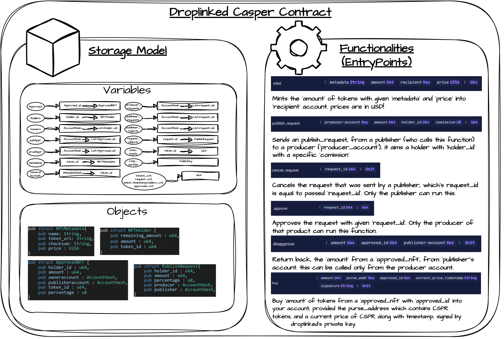

# Droplinked SmartContracts

# <u>Droplinked Contract Standard (DRC-42)</u>

> Overview & Introduction

Droplinkeds' contract implements base functionalities of ethereum's ERC-1155 standard. This contract implements SFT tokens (Semi-Fungible Token), which have both uniqueness and value. For example, a producer wants to mint 1M NFTs of the same product (each product has an nft which describes who owns the item); by minting 1M NFT's in a standard such as an ERC-721 (CEP47) is not cost effective (storing 1M ID's and owner address will cost a lot of gas); so instead of minting them one by one, we mint a base token (which contains the ID), and hold that id alongside the number of tokens that a particular account owns.

This way, we only store a single token ID (which represents the product), and a single number (which represents how many of these token ID's a person owns) for each particular account.

On droplinked, a publisher can send a publish request to the producer with a particular pre-defined commission amount. The producer can accept or reject requests and if a request is accepted, the publisher is then given the abilkity to publish the product to share with consumers and earn their entitled settlement portion.

## <u>Contract Instances</u>

- [Casper Network (CSPR)](https://github.com/FLATLAY/droplinked_casper)

- [NEAR Protocol (NEAR)](nearContract.md)

- [Stacks (STX)](stacks.md)

- [Polygon (MATIC)](polygon.md)

- [Ripple (XRP)](https://github.com/FLATLAY/droplinked-ripple)

- [Skale Network (SKL)](https://github.com/FLATLAY/droplinked_skale)

