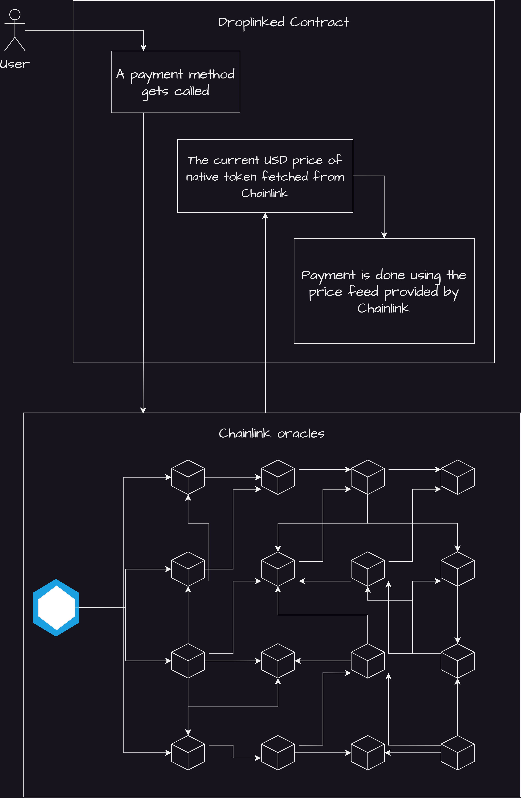
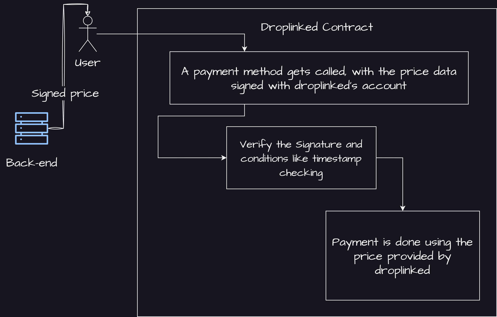

# EVM Chains

## Different Contract types
There are 2 different contracts for EVM based chains : 
- `ChainLink Compatible contract` for chains which have chainlink in them as price feeds
- `Price-Signature based contract` for chains which are EVM-Compatible but not built as an EVM chain and thus, don't support ChainLink

As it is obvious, the **ChainLink based** contracts have a nicer way of doing payments, less strugling(?) in back and front-end and more reliable and **decentralized**, becuase the price rate of the native currency of that network is fetched **within the contract** from a decentralized source (_ChainLink Oracles_).

If Chainlink is on a chain, then we use the Chainlink version of our contracts on our chain, and if not, we have to use Price-Signature based contracts.

There are lots of **EVM / EVM Compatible chains** out there, we are adding more chains to our system, but till now, we have integrated with these chains:
- **Polygon (ChainLink based)**
- **Binance (ChainLink based)**
- **Ripple (Price-Sig based)**
- **Hedera (Price-Sig based)**

Below is the flow of payment in ChainLink based contracts vs Price-Sig based ones:

- ChainLink based

- Price-Sig based

