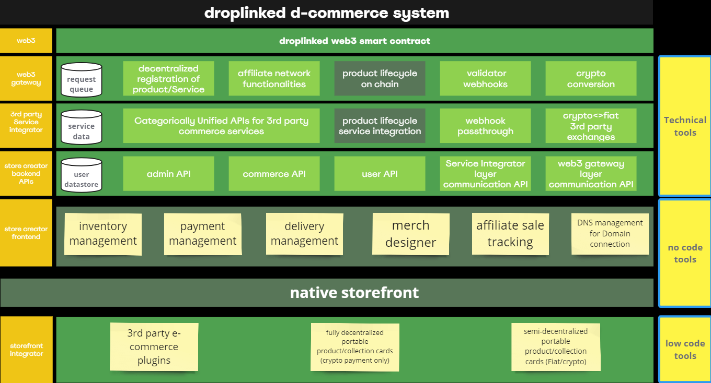

# <u>Droplinked Documentations</u>

On the droplinked protocol, we are registering products on chain and to enable 3rd party publishers to leverage these registered products and sell them across any marketplace, dapp or native site in order to earn commission. We are complimenting this with headless tooling for NFT Gated store fronts on droplinked.com and other valued added NFT solutions.

## • <u>Table of Contents</u>

| **NO.** |                      **Title**                      |                                                **Description**                                               |
|:-------:|:---------------------------------------------------:|:------------------------------------------------------------------------------------------------------------:|
|    1    | [Contract interface (DRC-42)](ContractInterface.md) |  Droplinked's Smart-Contract Standard Interface Documentation, including Contract Methods & Payment Methods  |
|    2    |          [Payment System](PaymentSystem.md)         | All payment types supported by Droplinked, and their process (Direct Pay, Pay for recorded Product and ...)  |
|    3    |       [Decentralization](Decentralization.md)       |                   The process of decentralizing droplinked's products (Record + Affiliate)                   |
|    4    |        [Payment Contract](PaymentContract.md)       |                    Droplinked's Smart Contract for Handling payments & Transferring tokens                   |
|    5    |             [Web3 Server](Web3Server.md)            |                         Droplinked Queue Server documentation for it's implementation                        |
|    6    | [Function Interface](functionInterface.md)          |                            Droplinked Front-end implementation function interfaces                           |
|    -1   |           [Terminology & Terms](Terms.md)           |                                 Droplinked Ecosystem's Terminology & Glossary                                |

### • <u>Droplinked D-Commerce Stack</u>

### • <u>Comming Soon</u>
- [ ] Droplinked's Smart-Contract Standard Interface Documentation update
- [ ] Droplinked Ecosystem's Terminology & Glossary
