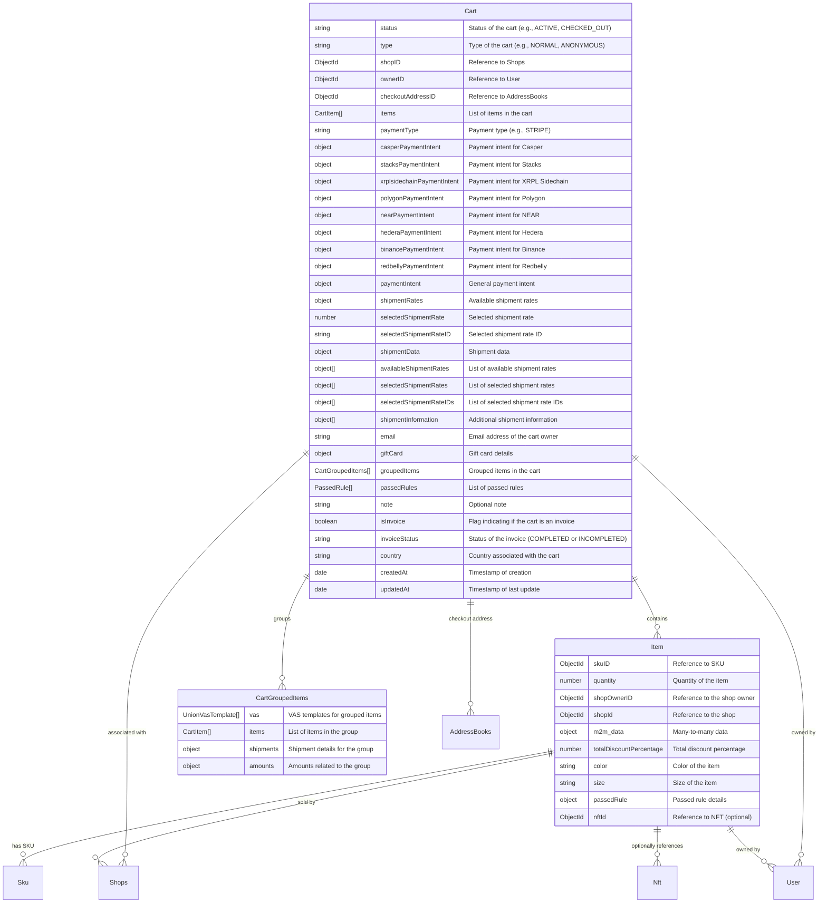

# Cart Module Documentation

## Overview

The Cart module manages the shopping cart functionality, including creating anonymous carts, managing cart items, and handling payment details. It includes the following key components:

1. **Controller**: Handles HTTP requests and API endpoints.
2. **Service**: Contains the business logic for managing carts.

---

## Cart Controller

### `createAnonymousCart` Endpoint

- **Description**: Allows public users to create an anonymous cart.
- **Route**: `POST /public/anonymous-cart`
- **Functionality**:
  - Calls the `createAnonymousCart` method from the `CartService`.
  - Returns the created cart object in the response.
- **Swagger Metadata**:
  - `@ApiOperation`: Describes the API operation.
  - `@ApiResponse`: Defines the expected HTTP response structure.

---

## Cart Service

### `createAnonymousCart`

- **Description**: 
  - Interacts with the Cart repository to create an anonymous cart.
  - Sets the cart type to `ANONYMOUS`.
- **Returns**: The newly created anonymous cart object.

---

## Database Model

### Mermaid Diagram

The following diagram visualizes the relationships and structure of the `Cart`, `Item`, and related models:



## addProductToCartV2 Service
## Step 1: Initial Validation

### Description
The first step ensures the integrity of input data before proceeding with adding a product to the cart. This is done by calling the `addToCartInitialValidation` function, which checks:

- `skuID` and `shopID` are valid ObjectIds.
- Anonymous carts cannot include a wallet address.
- Authenticated users can only add products from shops they own.

### Code
```typescript
await this.addToCartInitialValidation(
  query.skuID,
  anonymous,
  query?.wallet,
  query?.ownerID,
  query?.shopID,
);
