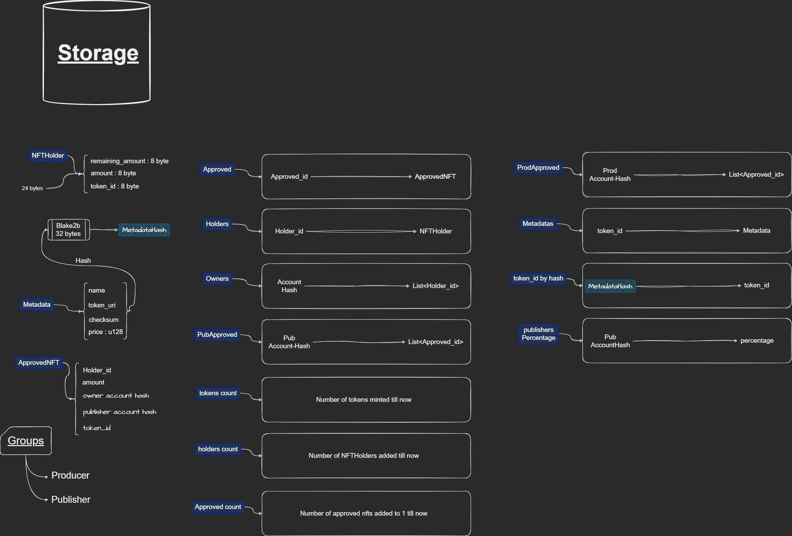

# Casper Contract interface

## Entrypoints
Entrypoints are like methods and functions in the casper's smart contract system that can be called from the inside of the contract or from an external account, The droplinked contract has these entrypoints: 

```
->approve         (request_id: U64)

->buy             (amount: U64, purse_addr: Key, approved_id: U64, 
                  current_price_timestamp: String, signature: String, 
                  shipping_price: U512, tax_price: U512): Unit

->cancel_request  (request_id: U64): Unit

->direct_pay      (product_price: U512, shipping_price: U512, 
                  tax_price: U512, recipient: String, 
                  purse_addr: Key): Unit

->disapprove      (amount: U64, approved_id: U64, publisher-account: Key): Unit

->mint            (metadata: String, amount: U64, recipient: Key, 
                  price: U64, comission: U8): U64

->publish_request (producer-account: Key, amount: U64, holder_id: U64): U64
```

## Storage

Note : The image below describes the Casper contract, but it needs to be updated (It's not exactly how it is now!)



## Source code
You can find the source of the casper contract alongside with the documentations and testings in [this](https://www.github.com/FLATLAY/droplinked_casper) repo.