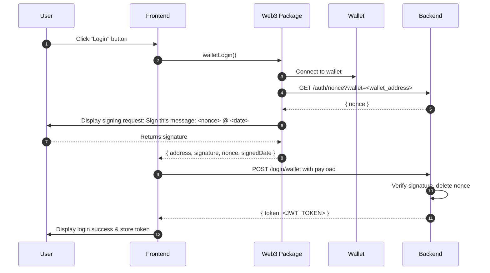

# Login with Wallet in Shop Frante

## Overview

This document describes the implementation of a wallet-based login feature in Shop Frante. The system leverages a Web3 package to interact with users' wallets for authentication and a backend service to verify signatures and issue JWT tokens.

## Components

-   **Frontend**: React application that initiates the login flow.
-   **Web3 Package**: Handles wallet connection, nonce retrieval, and signature prompt.
-   **Backend**: Provides nonce generation/storage and signature verification, then issues JWT.

## Architecture Diagram



## Workflow

1. **User Action**

    - The user clicks the **Login** button in the frontend.

2. **Frontend → Web3 Package**

    - The frontend calls the Web3 package's `walletLogin()` method.

3. **Web3 Package → Wallet**

    - The package connects to the user's wallet.

4. **Web3 Package → Backend (Nonce Request)**

    - Sends a request to `GET /auth/nonce?wallet=<wallet_address>`.
    - Backend generates a nonce for this address, stores it, and returns it.

5. **Web3 Package → User (Signature Request)**

    - Combines the nonce and current date into a message.
    - Prompts the user in their wallet to sign the message.

6. **User → Web3 Package (Signed Message)**

    - User signs the message and the package returns:
        - `address`
        - `signature`
        - `nonce`
        - `signedDate`

7. **Frontend → Backend (Login Request)**

    - Frontend sends a `POST` to `/login/wallet` with the payload.

8. **Backend (Verification & Token Issuance)**
    - Verifies the signature depending on the blockchain network.
    - If valid, deletes the stored nonce.
    - Issues a JWT token and returns it to the frontend.

## Frontend Implementation

**useProfile.ts**

```typescript
import { DropWeb3, Network, Web3Actions } from 'dropweb3';
import { postApi, postLogin } from './api';

export const useProfile = async () => {
	const web3 = new DropWeb3(appDevelopment ? Network.TESTNET : Network.MAINNET);
	const chainInstance = web3.web3Instance({
		method: Web3Actions.LOGIN,
		preferredWallet: preferredWallets,
	});

	let walletRes = await chainInstance.walletLogin();
	if (walletRes) {
		const result = await postApi(
			postLogin(
				walletRes.date,
				walletRes.address,
				walletRes.address,
				walletRes.signature,
				walletType,
				shopName,
				walletRes.nonce.toString()
			)
		);
		// Handle login result (store token, update UI, etc.)
	}
};
```

## Backend Implementation

**Endpoint**: `POST /login/wallet`

### Request Payload

```json
{
	"wallet": "261d24664f7d8b33193ab0a63ddb9a384b2ff0ef12b5ddb3a04b4fc72dd35747",
	"publicKey": "017498b89ad40ab04a7b7af156e23a1a8abc05e0f49fb39c8c6b416ed2209004df",
	"signature": "017498b89ad40ab04a7b7af156e23a1a8abc05e0f49fb39c8c6b416ed2209004df",
	"type": "POLYGON",
	"nonce": "string",
	"customerShop": "string",
	"signedDate": "10/29/2024, 10:19:41 AM"
}
```

### Response

```json
{
	"token": "<JWT_TOKEN>"
}
```

## Security Considerations

-   **Nonce Usage**: Each nonce is single-use and deleted post-verification to prevent replay attacks.
-   **Signature Verification**: Must be performed according to the specified blockchain network (e.g., Ethereum, Polygon).
-   **Timestamp Validation**: Optionally ensure `signedDate` is within an acceptable time window.

---

_End of document_
