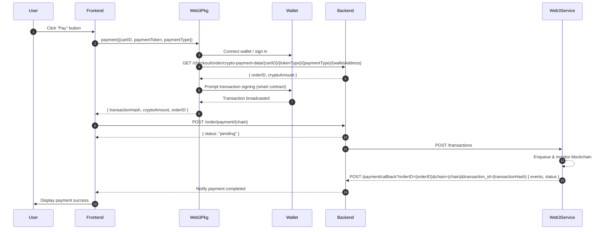

# Crypto Payment Flow in Shop Frante

## Overview

This document describes the implementation of the cryptocurrency payment feature in Shop Frante. It outlines how the frontend, Web3 package, backend, and Web3 service interact to process a payment via smart contract.

## Components

-   **Frontend**: React application that initiates and manages the payment flow.
-   **Web3 Package**: Handles wallet connection, retrieving payment data, and building transactions.
-   **Backend**: Provides payment data and processes transaction status updates.
-   **Web3 Service**: External backend service that monitors blockchain transactions and sends callbacks.

## Sequence Diagram



## Workflow

1. **User Completes Cart**

    - User finalizes cart and clicks the **Pay** button.

2. **Frontend → Web3 Package**

    - Calls `payment()` on the Web3 package with `cartID`, `paymentToken`, and `paymentType`.

3. **Web3 Package → Wallet**

    - Connects to the user's wallet and requests sign-in if needed.

4. **Web3 Package → Backend (Fetch Payment Data)**

    - Sends `GET /checkout/order/crypto-payment-data/{cartID}/{tokenType}/{paymentType}/{walletAddress}`.
    - Backend responds with `orderID` and `cryptoAmount`.

5. **Web3 Package → Wallet (Transaction Creation & Signing)**

    - Uses smart contract function to create a payment transaction.
    - Prompts user to sign and broadcast the transaction.

6. **Web3 Package → Frontend (Transaction Details)**

    - Returns `transactionHash`, `cryptoAmount`, and `orderID` to the frontend.

7. **Frontend → Backend (Record Payment)**

    - Calls `POST /order/payment/{chain}` with payload including `deploy_hash`, `cryptoAmount`, `orderID`, and `walletAddress`.
    - Backend sets payment status to pending.

8. **Backend → Web3 Service (Monitor Transaction)**

    - Sends `POST /transactions` to Web3 service with `transaction_id`, `callback_url`, `chain`, and `network`.

9. **Web3 Service → Backend (Callback)**

    - Monitors the blockchain, then calls back to `POST /payment/callback?orderID={orderID}&chain={chain}&transaction_id={transactionHash}` with `{ events, status }`.

10. **Backend (Finalize Payment)**

-   Validates callback data and updates payment status to completed.

## Frontend Implementation

```typescript
const web3 = new DropWeb3(appDevelopment ? Network.TESTNET : Network.MAINNET);

const loginInstance = web3.web3Instance({
	method: Web3Actions.LOGIN,
	preferredWallet: preferredWallets,
});
const sender = (await loginInstance.walletLogin()).address;

const chainInstance = web3.web3Instance({
	method: Web3Actions.PAYMENT,
	chain: getChain(walletType),
	preferredWallet: preferredWallets,
	userAddress: sender,
});

const paymentInputs = {
	cartID: currentCart?._id,
	paymentToken: PaymentTokens[token_type],
	paymentType: getChain(walletType),
};

const payment = await chainInstance.payment(paymentInputs);
// payment: { transactionHash, cryptoAmount, orderID }
```

## Backend APIs

### Fetch Payment Data

```
GET /checkout/order/crypto-payment-data/{cartID}/{tokenType}/{paymentType}/{walletAddress}
```

**Response**:

```json
{
	"orderID": "6332a65d26038728b5aa9e43",
	"cryptoAmount": 125.53424,
   ...
}
```

### Record Payment

```
POST /order/payment/{chain}
```

**Payload**:

```json
{
	"deploy_hash": "0x68213890d155f1ef9990e9d9fb8ed9f7cdb014c5c2f24a84b4807a0ac50aa040",
	"cryptoAmount": 125.53424,
	"orderID": "6332a65d26038728b5aa9e43",
	"walletAddress": "0x0"
}
```

## Web3 Service API

```
POST /transactions
```

**Payload**:

```json
{
	"transaction_id": "0x123abc456def789ghi012jkl345mno678pqr901stu",
	"callback_url": "https://api.yourdomain.com/transaction-updates",
	"chain": "ETH",
	"network": "MAINNET"
}
```

```
POST /payment/callback?orderID={orderID}&chain={chain}&transaction_id={transactionHash}
```

**Payload**:

```json
{
  "events": [...],
  "status": "TRANSACTION_STATUS.SUCCESS"
}
```

## Security Considerations

-   **Callback Validation**: Verify callback URLs and origin.
-   **Transaction Confirmation**: Ensure sufficient blockchain confirmations before marking complete.
-   **Error Handling**: Retry or notify on failed callbacks or transaction failures.

---

_End of document_
