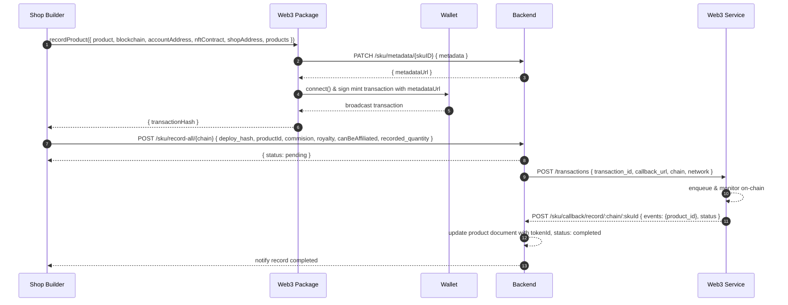

# Record Product (Minting) in Shop Builder

## Overview

This document describes the end-to-end flow for recording (minting) a product as an on-chain NFT. It involves the Shop Builder UI, the Web3 Package, the Backend API, and an external Web3 Service for transaction monitoring.

## Components

-   **Shop Builder**: UI where shop owner configures and triggers product minting.
-   **Web3 Package**: Handles metadata upload, wallet connection, and transaction creation.
-   **Backend**: Receives metadata uploads, deploy hashes, and processes callbacks.
-   **Web3 Service**: Monitors blockchain transactions and sends status callbacks.

## Sequence Diagram



## Workflow

1. **Initiate Record**

    - Shop Builder calls `recordProduct` on the Web3 Package with:
        - `product`, `blockchain`, `accountAddress`
        - `nftContractAddress`, `shopContractAddress`, `products`

2. **Upload Metadata**

    - Web3 Package generates NFT metadata JSON.
    - Calls Backend endpoint:
        ```
        PATCH /sku/metadata/{skuID}
        Body: { "metadata": <metadata> }
        ```
    - Receives `metadataUrl` in response.

3. **Create & Sign Transaction**

    - Web3 Package connects to user’s wallet.
    - Constructs mint transaction on shop’s smart contract, embedding `metadataUrl`.
    - Prompts user to sign and broadcast transaction.
    - Receives `transactionHash`.

4. **Record Deploy Hash**

    - Shop Builder sends:
        ```
        POST /sku/record-all/{chain}
        Body:
        {
          "deploy_hash": "<transactionHash>",
          "deploy_hash_link": "<optional link>",
          "productId": "<productId>",
          "commision": <number>,
          "royalty": <number>,
          "canBeAffiliated": <boolean>,
          "recorded_quantity": <number>
        }
        ```
    - Backend stores deploy hash, sets product record status to `pending`.

5. **Monitor Transaction**

    - Backend calls Web3 Service:
        ```
        POST /transactions
        Body:
        {
          "transaction_id": "<transactionHash>",
          "callback_url": "https://api.yourdomain.com/sku/record-callback",
          "chain": "<chain>",
          "network": "<network>"
        }
        ```
    - Web3 Service enqueues and watches blockchain until transaction is confirmed.

6. **Callback & Completion**
    - Web3 Service sends:
        ```
        POST /sku/callback/record/:chain/:skuId
        Body: { "events": [...], "status": "<TRANSACTION_STATUS>" }
        ```
    - Backend verifies callback, extracts `tokenId` and updates product document:
        - Store `tokenId` and `metadataUrl`.
        - Set status to `completed`.

## Shop Builder Code Sample

```typescript
const recordModel = {
	record: async ({
		product,
		blockchain,
		accountAddress,
		nftContract,
		shopAddress,
		products,
	}: Irecord) => {
		const web3 = new DropWeb3(appDevelopment ? Network.TESTNET : Network.MAINNET);
		const provider = web3.web3Instance({
			method: Web3Actions.RECORD_AFFILIATE,
			chain: Chain[blockchain],
			nftContractAddress: nftContract,
			shopContractAddress: shopAddress,
			preferredWallet: ChainWallet.Metamask,
			userAddress: accountAddress,
		});

		const type = ProductType.DIGITAL;
		const acceptsManageWallet = true;
		const pod = product.product_type === 'PRINT_ON_DEMAND';

		const skus: ISKUDetails[] = products.map((sku) => ({
			amount: pod ? sku.amount : sku.skuProperties.quantity,
			imageUrl: sku.image_url,
			skuID: sku.skuProperties['_id'],
			skuProperties: sku.skuProperties,
		}));

		const record: RecordResponse = await provider.recordProduct(
			{
				acceptsManageWallet,
				commission: products[0].commission * 100,
				royalty: products[0].royalty * 100,
				description: product.description,
				productTitle: product.title,
				type,
			},
			skus
		);

		return record;
	},
};
```

## Backend Endpoints

### Upload Metadata

```
PATCH /sku/metadata/{skuID}
Body: { "metadata": <object> }
```

### Record Deploy Hash

```
POST /sku/record-all/{chain}
Body:
{
  "deploy_hash": "<string>",
  "deploy_hash_link": "<url>",
  "productId": "<string>",
  "commision": <number>,
  "royalty": <number>,
  "canBeAffiliated": <boolean>,
  "recorded_quantity": <number>
}
```

### Transaction Callback

```
POST /sku/record-callback
Body: { "events": [...], "status": "<string>", "tokenId": "<string>", "metadataUrl": "<string>" }
```

## Web3 Service API

```
POST /transactions
Body:
{
  "transaction_id": "<string>",
  "callback_url": "<url>",
  "chain": "<string>",
  "network": "<string>"
}
```

## Security & Error Handling

-   Validate incoming DTOs and callback origins.
-   Retry failed metadata uploads or callbacks.
-   Handle duplicate callbacks idempotently.

---

_End of document_
