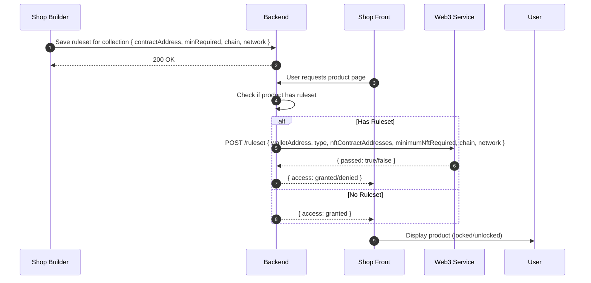

# Ruleset Access Control in Shop Frante

## Overview

This document describes the ruleset-based gated access feature in Shop Frante. Shop owners can define NFT-based rulesets to control product purchases. Users attempting to buy such products must satisfy the ruleset by holding the required NFTs.

## Components

-   **Shop Builder**: Interface where shop owners configure collections and rulesets.
-   **Shop Front**: Customer-facing storefront where users browse and purchase.
-   **Backend**: Stores ruleset configurations and orchestrates validation.
-   **Web3 Service**: External service that verifies on-chain NFT ownership.

## Sequence Diagram



## Workflow

1. **Shop Owner Configures Ruleset**

    - In the Shop Builder, the owner navigates to a collection and adds a ruleset.
    - Inputs include NFT contract address(es), minimum NFTs required, blockchain chain, and network.
    - Shop Builder sends this data to the Backend (`POST /ruleset`), and the Backend stores it.

2. **User Browses Product**

    - A user visits the Shop Front and opens a product page that has an associated ruleset.

3. **Backend Checks Ruleset Requirement**

    - Backend detects that the product is gated by a ruleset.

4. **Backend Requests Validation from Web3 Service**

    - Backend sends a `POST /ruleset` to the Web3 Service with payload:
        ```json
        {
        	"walletAddress": "0x1234567890abcdef1234567890abcdef12345678",
        	"type": "GATED",
        	"nftContractAddresses": ["0xabcdef1234567890abcdef1234567890abcdef12"],
        	"minimumNftRequired": 3,
        	"chain": "BINANCE",
        	"network": "MAINNET"
        }
        ```
    - Web3 Service checks on-chain ownership and returns:
        ```json
        {
        	"passed": true
        }
        ```

5. **Backend Grants or Denies Access**

    - If `passed` is `true`, Backend responds to Shop Front with `{ access: "granted" }`.
    - If `false`, responds with `{ access: "denied" }`.

6. **Shop Front Displays Product**
    - Based on the response, the Shop Front shows the product as unlocked or locked.

## API Endpoints

### Configure Ruleset

```
POST /ruleset
```

**Payload**:

```json
{
	"collectionId": "string",
	"type": "GATED",
	"nftContractAddresses": ["0x..."],
	"minimumNftRequired": 3,
	"chain": "BINANCE",
	"network": "MAINNET"
}
```

**Response**:

```json
200 OK
```

### Validate Ruleset

```
POST /ruleset
```

**Request from Backend to Web3 Service**:

```json
{
	"walletAddress": "0x1234...abcd",
	"type": "GATED",
	"nftContractAddresses": ["0x..."],
	"minimumNftRequired": 3,
	"chain": "BINANCE",
	"network": "MAINNET"
}
```

**Response**:

```json
{
	"passed": true
}
```

## Security Considerations

-   **Data Integrity**: Ensure ruleset configuration payloads are authenticated and validated.
-   **Rate Limiting**: Protect the Web3 Service from excessive validation requests.
-   **Caching**: Optionally cache validation results for a short period to reduce on-chain queries.

---

_End of document_
